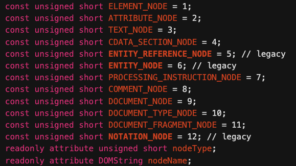

# Advanced DOM & Events

### - Знать типы узлов. Уметь работать с узлами (поиск, создание, перемещение и т.д.)
### - Знать и уметь работать с атрибутами и свойствами элементов. Особые атрибуты (class, style, data).
### - Знать и уметь обрабатывать события в документе и на элементах(знать методы, опции и особенности)
### - Знать жизненный цикл события
### - Знать что такое event delegation и для чего
### - Знать как загружать скрипты (и различные особенности)

DOM (Document Object Model) — это программный интерфейс, представляющий HTML-документ как дерево объектов. Каждый элемент, атрибут и текст в документе становится узлом в этом дереве, с которым можно взаимодействовать через JavaScript. DOM позволяет динамически изменять содержимое, структуру и стили веб-страницы.

BOM (Browser Object Model) — это модель, которая предоставляет доступ к объектам браузера, не связанным напрямую с содержимым страницы. BOM включает такие объекты, как:

- `window` (глобальный объект, представляющий окно браузера),
- `navigator` (информация о браузере),
- `location` (управление URL),
- `history` (управление историей браузера),
- `screen` (информация об экране).

Основное различие: DOM работает с содержимым страницы, а BOM — с браузером и его окружением.

---

## 1) Типы узлов

Полный список типов узлов

1) `ELEMENT_NODE` (1)
Узел, представляющий HTML-элемент (например, `<div>`, `<p>`).
2) ~~`ATTRIBUTE_NODE` (2)
Узел атрибута элемента (например, id="myId").
Примечание: В современном JavaScript атрибуты обычно обрабатываются через методы `getAttribute`/`setAttribute`, а узлы атрибутов редко используются напрямую.~~
3) `TEXT_NODE` (3)
Текстовое содержимое элемента или атрибута (например, текст внутри `<p>Привет</p>`).
4) `CDATA_SECTION_NODE` (4)
Узел для секций CDATA в XML-документах (например, `<![CDATA[...]]>`).
Примечание: В HTML этот тип практически не используется, так как CDATA чаще встречается в XML.
5) ~~`ENTITY_REFERENCE_NODE` (5)
Узел, представляющий ссылку на сущность (например, `&amp;`).
Примечание: Этот тип устарел и не используется в современных браузерах для HTML.~~
6) ~~`ENTITY_NODE` (6)
Узел, представляющий определение сущности в DTD (например, `<!ENTITY ...>`).
Примечание: Также устарел и не используется в HTML.~~
7) `PROCESSING_INSTRUCTION_NODE` (7)
Узел для инструкций обработки, например, `<?xml-stylesheet ...?>`.
Примечание: Используется в XML, но редко в HTML.
8) `COMMENT_NODE` (8)
Узел для комментариев (например, `<!-- Комментарий -->`).
9) `DOCUMENT_NODE` (9)
Корневой узел документа (например, объект document).
10) `DOCUMENT_TYPE_NODE` (10)
Узел, представляющий декларацию `<!DOCTYPE>` (например, `<!DOCTYPE html>`).
11) `DOCUMENT_FRAGMENT_NODE` (11)
Узел для временного контейнера узлов (`DocumentFragment`), используемого для оптимизации операций с DOM.
12) ~~`NOTATION_NODE` (12)
Узел для нотаций, определённых в DTD (например, `<!NOTATION ...>`).
Примечание: Устарел и не используется в HTML.~~


https://dom.spec.whatwg.org/#node

---

## 2) Методы поиска в DOM и их поведение

- `querySelector(selector)`
Ищет первый элемент, соответствующий CSS-селектору, внутри указанного элемента.

```js
const parent = document.querySelector('.parent');
const child = parent.querySelector('.child');
```
Возвращает: Один элемент или `null`

- `querySelectorAll(selector)`

Ищет все элементы, соответствующие CSS-селектору, внутри указанного элемента.

```js
const parent = document.querySelector('.parent');
const children = parent.querySelectorAll('.child');
```

Возвращает: Статический `NodeList`.

- `getElementsByClassName(className)`

Ищет все элементы с указанным классом внутри элемента.

```js
const parent = document.querySelector('.parent');
const items = parent.getElementsByClassName('item');
```
Возвращает: Живую `HTMLCollection`

- `getElementsByTagName(tagName)`

Ищет все элементы с указанным тегом внутри элемента.

```js
const parent = document.querySelector('.parent');
const divs = parent.getElementsByTagName('div');
```
Возвращает: Живую `HTMLCollection`

- `getElementsByName(name)`

Ищет элементы с атрибутом `name` внутри элемента. Обычно используется для форм.

```js
const form = document.querySelector('form');
const inputs = form.getElementsByName('username');
```
Возвращает: Живую `HTMLCollection`

- `getElementById(id)`

Ищет элемент по `id`.

```js
const div = document.getElementById('123');
console.log(div.firstChild);
```
Возвращает: Один элемент или `null`.

---
## 3) Навигация по дом от узла

- `element.closest(selector)`
Метод `element.closest(selector)` в JavaScript используется для поиска ближайшего родительского элемента (включая сам элемент), который соответствует указанному CSS-селектору. Если подходящий элемент не найден, возвращается `null`.

Вернет себя:
```js
const div = document.getElementById('test123');
console.log(div.closest('#test123'));
```

- `firstChild` и `firstElementChild`

`firstChild` возвращает первый дочерний узел (любой тип: элемент, текст, комментарий), включая пробелы и переносы строк.

`firstElementChild` возвращает первый дочерний элемент (только HTML-элемент), игнорируя текстовые узлы и комментарии.

- `lastChild` и `lastElementChild`

Последний ребенок

- `childNodes` и `children`

Возвращает дочерние `NodeList` и `HTMLCollection`

- `parentNode`

Возвращает родительскую ноду

- `previousSibling` и `previousElementSibling`

Возвращает предыдущего брата или сестру(элементы одного родителя)

- `nextSibling` и `nextElementSibling`

Возвращает следующего брата или сестру

## 4) Создание, вставка и перемещение узлов

  1) Создание
  - `document.createElement(tagName)`
  - `document.createTextNode(text)`
  - `document.createComment(text)`
  - `document.createDocumentFragment()` -
  cоздает объект `DocumentFragment`, который является легковесным контейнером для хранения узлов.
  Используется для группировки узлов перед вставкой в DOM, чтобы минимизировать операции перерисовки (reflow/repaint).

  2) Вставка
  - `Node.append(...nodes)`
  Добавляет узлы или строки в конец указанного родителя.
  Принимает как узлы, так и строки (строки преобразуются в текстовые узлы).
  - `Node.prepend(...nodes)`
  Добавляет узлы или строки в начало указанного родителя.
  - `Node.appendChild(node)`
  Добавляет один узел в конец родителя.
  Возвращает добавленный узел. Не принимает строки.
  - `Node.insertBefore(newNode, referenceNode)`
  Вставляет `newNode` перед указанным `referenceNode` внутри родителя.
  Если `referenceNode` — `null`, узел добавляется в конец.
  - `Element.after(...nodes)`
  Вставляет узлы или строки после указанного элемента (на том же уровне).
  - `Element.before(...nodes)`
  Вставляет узлы или строки перед указанным элементом.
  - `Element.insertAdjacentElement(position, element)`
  Вставляет элемент в одну из четырех позиций относительно целевого элемента:
    - `beforebegin`: перед элементом.
    - `afterbegin`: в начало элемента.
    - `beforeend`: в конец элемента.
    - `afterend`: после элемента.

  3) Перемещение узлов

  Перемещение узлов — это процесс изменения местоположения существующего узла в DOM. Поскольку узел не может находиться в двух местах одновременно, DOM автоматически удаляет узел из его текущего местоположения при вставке в новое.

  4) Удаление узлов
  - `Node.remove()`
  Удаляет узел непосредственно из DOM.
  Это современный и наиболее простой метод, не требующий обращения к родителю.
  Поддерживается во всех современных браузерах.
  - `Node.removeChild(child)`
  Удаляет указанный дочерний узел из родителя.
  Возвращает удаленный узел, который можно использовать повторно.
  Требует, чтобы вызывающий объект был родителем удаляемого узла.
  - `Node.replaceChild(newNode, oldNode)`
  Заменяет oldNode на newNode, эффективно удаляя oldNode.
  Используется, когда удаление совмещается с добавлением нового узла (см. также раздел о замене в предыдущем ответе).


## 5) Классы DOM-узлов

У разных DOM-узлов могут быть разные свойства. Например, у узла, соответствующего тегу `<a>`, есть свойства, связанные со ссылками, а у соответствующего тегу `<input>` – свойства, связанные с полем ввода и т.д. Текстовые узлы отличаются от узлов-элементов. Но у них есть общие свойства и методы, потому что все классы DOM-узлов образуют единую иерархию.

Каждый DOM-узел принадлежит соответствующему встроенному классу.

Корнем иерархии является `EventTarget`, от него наследует `Node` и остальные DOM-узлы.

На рисунке ниже изображены основные классы:


Существуют следующие классы:

- `EventTarget` – это корневой «абстрактный» класс для всего.

Объекты этого класса никогда не создаются. Он служит основой, благодаря которой все DOM-узлы поддерживают так называемые «события», о которых мы поговорим позже.

- `Node` – также является «абстрактным» классом, и служит основой для DOM-узлов.

Он обеспечивает базовую функциональность: `parentNode`, `nextSibling`, `childNodes` и т.д. (это геттеры). Объекты класса `Node` никогда не создаются. Но есть определённые классы узлов, которые наследуются от него (и следовательно наследуют функционал `Node`).

- `Document`, по историческим причинам часто наследуется `HTMLDocument` (хотя последняя спецификация этого не навязывает) – это документ в целом.

Глобальный объект document принадлежит именно к этому классу. Он служит точкой входа в DOM.

- `CharacterData` – «абстрактный» класс. Вот, кем он наследуется:

  - `Text` – класс, соответствующий тексту внутри элементов. Например, Hello в <p>Hello</p>.
  - `Comment` – класс для комментариев. Они не отображаются, но каждый комментарий становится членом DOM.

- `Element` – это базовый класс для DOM-элементов.

Он обеспечивает навигацию на уровне элементов: `nextElementSibling`, `children`. А также и методы поиска элементов: `getElementsByTagName`, `querySelector`.

Браузер поддерживает не только HTML, но также XML и SVG. Таким образом, класс Element служит основой для более специфичных классов: `SVGElement`, `XmlElement` (они нам здесь не нужны) и `HTMLElement`.

- И наконец, `HTMLElement` является базовым классом для всех остальных HTML-элементов. Мы будем работать с ним большую часть времени.

От него наследуются конкретные элементы:

  - `HTMLInputElement` – класс для тега `<input>`,
  - `HTMLBodyElement` – класс для тега `<body>`,
  - `HTMLAnchorElement` – класс для тега `<a>`,
  - …и т.д.

Также существует множество других тегов со своими собственными классами, которые могут иметь определенные свойства и методы, в то время как некоторые элементы, такие как `<span>`, `<section>` и `<article>`, не имеют каких-либо определенных свойств, поэтому они являются экземплярами класса `HTMLElement`.

Таким образом, полный набор свойств и методов данного узла является результатом цепочки наследования.

Рассмотрим DOM-объект для тега `<input>`. Он принадлежит классу `HTMLInputElement`.

Он получает свойства и методы из (в порядке наследования):

- `HTMLInputElement` – этот класс предоставляет специфичные для элементов формы свойства,
- `HTMLElement` – предоставляет общие для HTML-элементов методы (и геттеры/сеттеры),
- `Element` – предоставляет типовые методы элемента,
- `Node` – предоставляет общие свойства DOM-узлов,
- `EventTarget` – обеспечивает поддержку событий (поговорим о них дальше),
- …и, наконец, он наследует от `Object`, поэтому доступны также методы «обычного объекта», такие как `hasOwnProperty`.

