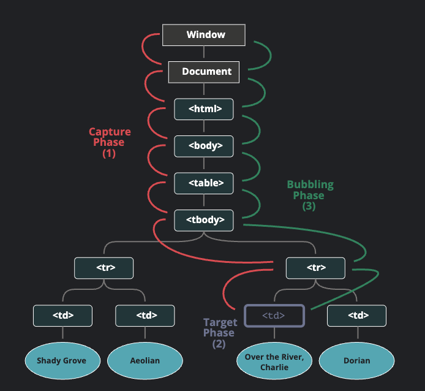
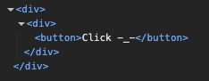

# Жизненный цикл события

### 3 фазы события

Стандарт `DOM Events` описывает 3 фазы прохода события:

1) Фаза погружения (capturing phase) – событие сначала идёт сверху вниз.
2) Фаза цели (target phase) – событие достигло целевого(исходного) элемента.
3) Фаза всплытия (bubbling stage) – событие начинает всплывать.

Картинка из спецификации демонстрирует, как это работает при клике по ячейке `<td>`, расположенной внутри таблицы:


То есть при клике на `<td>` событие путешествует по цепочке родителей сначала вниз к элементу (погружается), затем оно достигает целевой элемент (фаза цели), а потом идёт наверх (всплытие), вызывая по пути обработчики.

Обработчики, добавленные через `on<event>`-свойство или через HTML-атрибуты, или через `addEventListener(event, handler)` с двумя аргументами, ничего не знают о фазе погружения, а работают только на 2-ой и 3-ей фазах.

Чтобы поймать событие на стадии погружения, нужно использовать третий аргумент `capture` вот так:

```js
elem.addEventListener(..., {capture: true})
// или просто "true", как сокращение для {capture: true}
elem.addEventListener(..., true)
```

Существуют два варианта значений опции `capture`:

Если аргумент `false` (по умолчанию), то событие будет поймано при всплытии.
Если аргумент `true`, то событие будет перехвачено при погружении.

Обратите внимание, что хоть и формально существует 3 фазы, 2-ую фазу («фазу цели»: событие достигло элемента) нельзя обработать отдельно, при её достижении вызываются все обработчики: и на всплытие, и на погружение.

### Примеры
Создадим простую вложенную структуру из `div` => `div` => `button` и повесим на них ивенты.


В первом примере оставим дефолтное значение `capture`(`false`). И все сработают на фазе всплытия.

И при нажатии на `button` получим `button` => `innerDiv` => `outerDiv`.

```js
const main = document.getElementById('test123');

function logTar(event) {
  console.log(event.target, this);
};

const outerDiv = document.createElement('div'); // самый верхний контейнер
const innerDiv = document.createElement('div'); // контейнер внутри outerDiv
const button = document.createElement('button'); // кнопка внутри innerDiv
button.textContent = 'Click -_-';

// добавляем элементы
innerDiv.appendChild(button);
outerDiv.appendChild(innerDiv);
main.after(outerDiv);

// вешаем слушатели
outerDiv.addEventListener('click', logTar);
innerDiv.addEventListener('click', logTar);
button.addEventListener('click', logTar);
```

В примере №2 установим для `outerDiv` значение `capture`: `true`. Следовательно `outerDiv` сработает на фазе захвата/погружения, а остальные на фазе всплытия.

И при нажатии на `button` получим `outerDiv` => `button` => `innerDiv`

```js
const main = document.getElementById('test123');

function logTar(event) {
  console.log(event.target, this);
};

const outerDiv = document.createElement('div'); // самый верхний контейнер
const innerDiv = document.createElement('div'); // контейнер внутри outerDiv
const button = document.createElement('button'); // кнопка внутри innerDiv
button.textContent = 'Click -_-';

// добавляем элементы
innerDiv.appendChild(button);
outerDiv.appendChild(innerDiv);
main.after(outerDiv);

// вешаем слушатели
outerDiv.addEventListener('click', logTar);
innerDiv.addEventListener('click', logTar);
button.addEventListener('click', logTar, true);

console.log(Object.getPrototypeOf(button));
```
