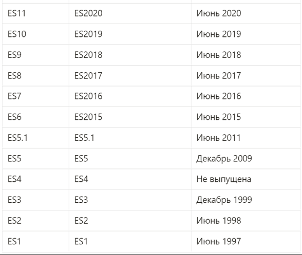

**ECMAScript (или ES)** - это стандартизированный язык сценариев, разработанный и поддерживаемый организацией Ecma International (ранее European Computer Manufacturers Association). Он был создан для унификации языков программирования, таких как JavaScript, и обеспечения их совместимости между различными платформами и реализациями. ECMAScript определяет:

Синтаксис: правила написания кода (например, как задавать переменные, функции, циклы).
Семантику: поведение языка (например, как выполняются операции, как обрабатываются ошибки).
Базовые возможности: встроенные объекты (Array, Object, Date), типы данных (Number, String, Boolean, Symbol и др.), механизмы работы с асинхронностью (Promises, async/await) и многое другое.
ECMAScript не привязан к конкретной среде выполнения (например, браузеру или серверу), а является абстрактным стандартом. JavaScript — это самая известная реализация ECMAScript, используемая в веб-разработке (в браузерах и на серверах с помощью Node.js). Другие реализации включают JScript (от Microsoft) и ActionScript (использовался в Adobe Flash).

### Историческая справка
Ecma International — основанная в 1961 году ассоциация, деятельность которой посвящена стандартизации информационных и коммуникационных технологий. Изначально ассоциация называлась ECMA — European Computer Manufacturers Association, однако она сменила название в 1994 году в связи с глобализацией деятельности. Вследствие этого название Ecma перестало быть аббревиатурой и больше не пишется заглавными буквами.

Когда JavaScript был создан, он был представлен Netscape и Sun Microsystems для Ecma, и они дали ему имя ECMA-262 (псевдоним ECMAScript).

До ES2015 спецификации ECMAScript обычно назывались их редакцией. Таким образом, ES5 является официальным названием обновления спецификации ECMAScript, опубликованной в 2009 году.

В процессе разработки ES2015, название было изменено с ES6 на ES2015, но мир всё еще называет релизы ES номером издания.

Также комитетом было принято решение о ежегодном пересмотре и выпуске стандарта, в результате, начиная с 2015 года, мы каждый год получаем новый стандарт ECMAScript.

Для лучшего понимания исторической последовательности развития стандартов JavaScript смотрите табличку ниже:

### Основные этапы:

- ES1 (1997): Первая версия, базировалась на JavaScript от Netscape.
- ES2 (1998): Незначительные изменения для соответствия стандарту ISO.
- ES3 (1999): Добавлены регулярные выражения, try-catch, улучшены строки и массивы. Эта версия широко использовалась долгое время.
- ES4 (брошен): Планировалась как крупное обновление, но из-за разногласий проект был отменён.
- ES5 (2009): Введены строгий режим ("use strict"), методы для работы с массивами (map, filter, reduce), JSON, улучшены объекты.
- ES6/ES2015 (2015): Крупное обновление, добавлены классы, стрелочные функции, let/const, модули, Promises, шаблонные строки, деструктуризация и многое другое. Это был переломный момент, сделавший язык современным.
- ES2016 и далее: С 2015 года ECMAScript перешёл на ежегодный цикл выпуска новых версий, добавляя меньшие, но регулярные улучшения.

## Нововведения
### [ES2015](./es6/REAdME.md)
### [ES2016](./es2016/REAdME.md)