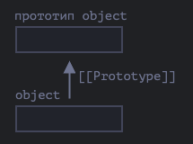

## Прототипное наследование

### `[[Prototype]]`
В JavaScript объекты имеют специальное скрытое свойство [[Prototype]] (так оно названо в спецификации), которое либо равно null, либо ссылается на другой объект. Этот объект называется «прототип»:



Прототип даёт нам немного «магии». Когда мы хотим прочитать свойство из object, а оно отсутствует, JavaScript автоматически берёт его из прототипа. В программировании такой механизм называется «прототипным наследованием». Многие интересные возможности языка и техники программирования основываются на нём.

Свойство `[[Prototype]]` является внутренним и скрытым, но есть много способов задать его.

Одним из них является использование `__proto__`.

----

Ограничения для `__proto__`:
- Ссылки не могут идти по кругу. JavaScript выдаст ошибку, если мы попытаемся назначить `__proto__` по кругу.
- Значение `__proto__` может быть объектом или null. Другие типы игнорируются.

----

Свойство `__proto__` — исторически обусловленный геттер/сеттер для `[[Prototype]]`
Это распространённая ошибка начинающих разработчиков – не знать разницы между этими двумя понятиями.

Обратите внимание, что `__proto__` — не то же самое, что внутреннее свойство `[[Prototype]]`. Это геттер/сеттер для `[[Prototype]]`. Позже мы увидим ситуации, когда это имеет значение, а пока давайте просто будем иметь это в виду, поскольку мы строим наше понимание языка JavaScript.

Свойство `__proto__` немного устарело, оно существует по историческим причинам. Современный JavaScript предполагает, что мы должны использовать функции Object.getPrototypeOf/Object.setPrototypeOf вместо того, чтобы получать/устанавливать прототип. Мы также рассмотрим эти функции позже.

По спецификации `__proto__` должен поддерживаться только браузерами, но по факту все среды, включая серверную, поддерживают его. Так что мы вполне безопасно его используем.

Далее мы будем в примерах использовать `__proto__`, так как это самый короткий и интуитивно понятный способ установки и чтения прототипа.

### Наследование от Hero

```js
export function Hero(params) {
  this.name = params.name;
  this._health = params.health;
  this.damage = params.damage;
  Object.defineProperty(this, "health", {
    get: function () {
      return this._health;
    },
    set: function (value) {
      if (value <= 0) {
        console.log(`${this.name} убит!`);
      }
      this._health = Math.max(0, value);
    },
  });
}

Hero.prototype.isAlive = function () {
  return this.health > 0;
};

Hero.prototype.attack = function () {
  if (this.isAlive()) {
    console.log(`${this.name} атакует и наносит ${this.damage} урона!`);
  } else {
    console.log(`${this.name} мертв!`);
  }
};

export function Assassin(params) {  
  Hero.call(this, params);
  this._isHidden = false;
}

Assassin.prototype = Object.create(Hero.prototype);
Assassin.prototype.constructor = Assassin;

Assassin.prototype.hide = function () {
  this._isHidden = true;
};

Assassin.prototype.attack = function () {
  if (this.isAlive()) {
    console.log(
      `${this.name} проводит ${
        this._isHidden ? "скрытную " : ""
      }атаку и наносит ${
        this._isHidden ? this.damage * 1.5 : this.damage
      } урона!`
    );
  } else {
    console.log(`${this.name} мертв!`);
  }
};
```

### Преимущества:
- **Экономия памяти за счёт общего использования методов.**.

### Недостатки:
- **Сложно для понимания**.
- **Риск неожиданного поведения при мутации прототипов.**